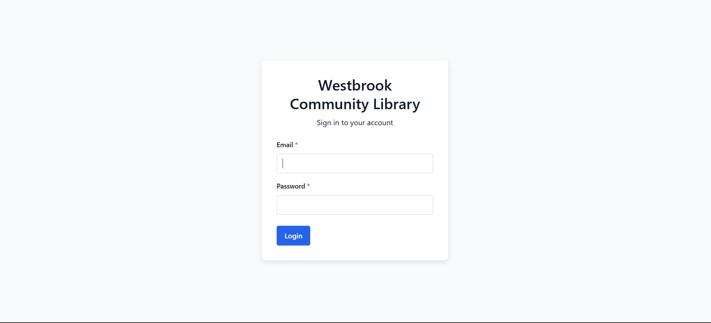
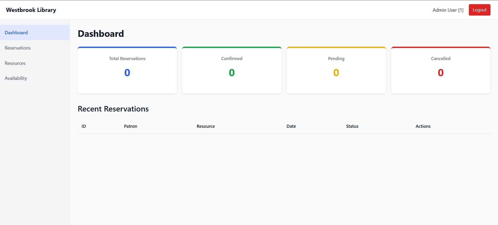
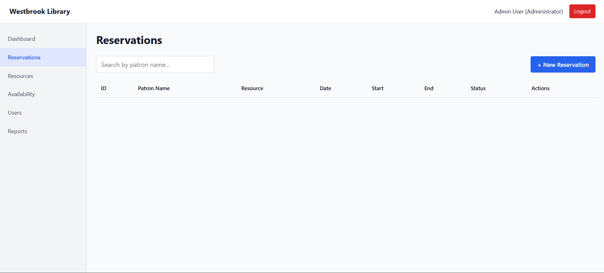
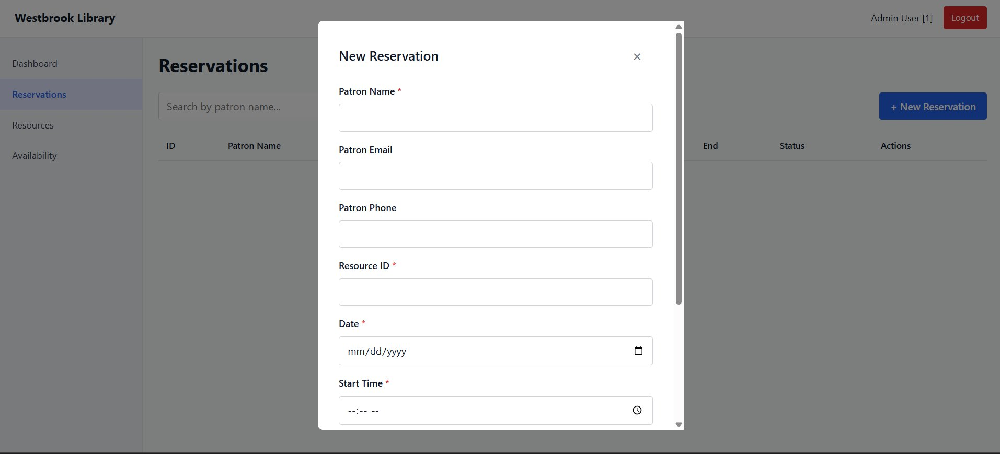
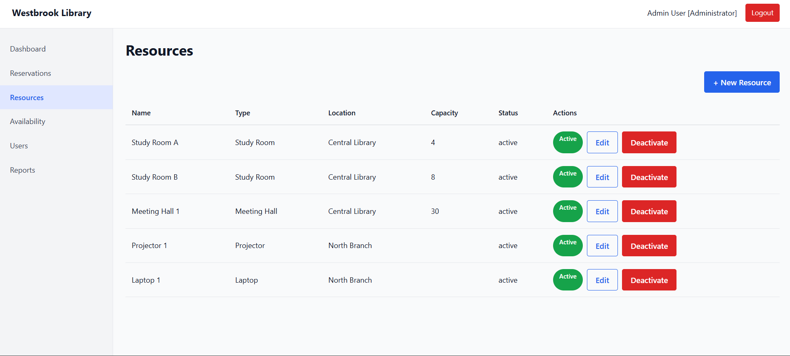
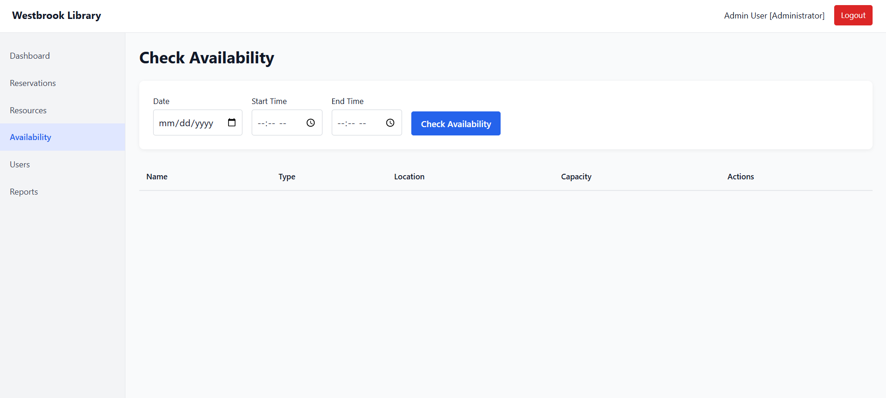
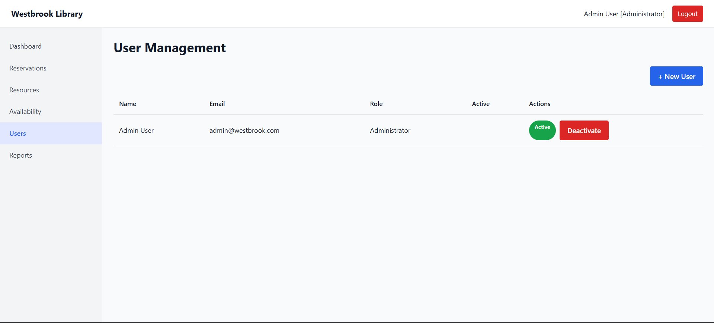
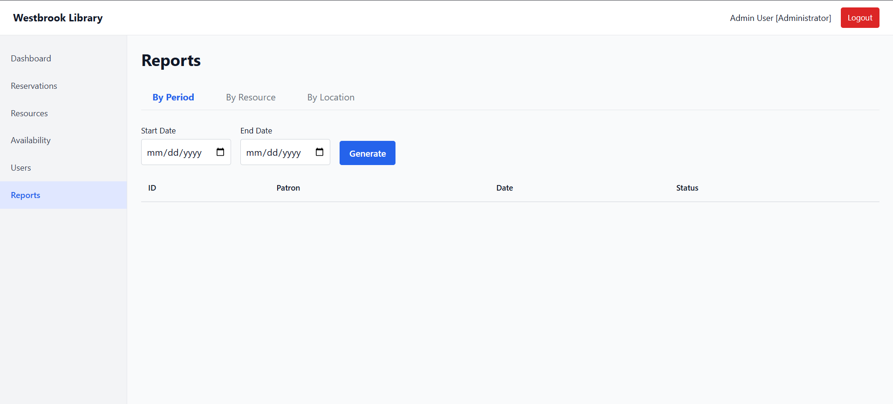

# 🏛️ Westbrook Community Library — Reservation Management System

<p align="center">
  <b>A full-stack web application for managing library room and equipment reservations across three branch locations.</b>
</p>

---

## Project Description

This repository contains the full Software Development Life Cycle (SDLC) documentation and source code for the **Westbrook Community Library Reservation Management System** — a project developed as part of an AI-assisted software engineering exercise using aXet tools.

## Business Context

Westbrook Community Library serves approximately 45,000 residents across one central building and two branch locations. All room and equipment reservations were previously managed manually through paper logbooks, phone calls, and informal emails — with no centralized system across the three locations.

This caused double-bookings, lost records, staff overload, patron dissatisfaction, and lack of visibility for management decisions.

This system solves those problems by providing a centralized, role-based reservation management platform accessible from any browser.

---

## 🖥️ Application Screenshots

### Login
> Secure authentication screen for library staff and administrators.



---

### Dashboard
> Overview of reservation statistics and recent activity.



---

### Reservations
> Full list of reservations with search, filter, and new booking functionality.



---

### New Reservation Modal
> Form for creating a new reservation with patron details, resource, date and time.



---

### Resources
> Manage library rooms and equipment — view, edit, and deactivate resources.



---

### Check Availability
> Search available resources by date and time slot across all locations.



---

### User Management *(Administrator only)*
> Create and manage staff accounts with role-based access control.



---

### Reports *(Administrator only)*
> Usage reports by period, resource, and location for management insight.



---

## 🗂️ Repository Structure

```
westbrook-library-reservation/
│
├── README.md
├── docs/
│   ├── pdf/                        # Final deliverables (PDF format)
│   ├── md/                         # Documents in Markdown
│   │   ├── FunctionalAnalysis_v1.0.md
│   │   ├── UserStories_v1.0.md
│   │   ├── TechnicalDesign_v1.0.md
│   │   └── TestPlan_v1.0.md
│   ├── screenshots/                # Application screenshots
│   └── prompts/                    # AI prompts used at each SDLC phase
│
├── src/
│   ├── backend/                    # Node.js + Express REST API
│   │   ├── controllers/
│   │   ├── services/
│   │   ├── models/
│   │   ├── routes/
│   │   ├── middleware/
│   │   ├── config/
│   │   ├── database/
│   │   │   └── schema.sql
│   │   └── server.js
│   │
│   └── frontend/                   # React 18 + Vite SPA
│       ├── components/
│       ├── pages/
│       ├── hooks/
│       ├── services/
│       ├── context/
│       └── router/
│
└── tests/                          # Unit and integration tests
    ├── auth.service.test.js
    ├── auth.api.test.js
    ├── reservation.service.test.js
    ├── reservation.api.test.js
    └── resource.service.test.js
```

---

## ✨ Technology Stack

| Layer | Technology | Version |
|---|---|---|
| Frontend | React | 18.x |
| Build Tool | Vite | 5.x |
| Routing | React Router | v6 |
| HTTP Client | Axios | 1.x |
| Backend | Node.js + Express | 20 LTS / 4.x |
| Database | PostgreSQL | 15+ |
| Authentication | JWT (jsonwebtoken) | 9.x |
| Password Hashing | bcrypt | 5.x |
| Input Validation | express-validator | 7.x |
| Testing | Jest + Supertest | 29.x |
| Dev Server | nodemon | 3.x |

---

## 🚀 Quickstart

### Prerequisites

- Node.js >= 20
- PostgreSQL 15+
- npm

### 1. Clone the repository

```bash
git clone https://github.com/your-org/westbrook-library-reservation.git
cd westbrook-library-reservation
```

### 2. Set up the database

```bash
psql -U postgres -c "CREATE DATABASE westbrook_library;"
psql -U postgres -d westbrook_library -f src/backend/database/schema.sql
```

### 3. Configure environment variables

```bash
cp src/backend/.env.example src/backend/.env
```

Edit `src/backend/.env` with your database credentials:

```env
NODE_ENV=development
PORT=3001
DB_HOST=localhost
DB_PORT=5432
DB_NAME=westbrook_library
DB_USER=postgres
DB_PASSWORD=yourpassword
JWT_SECRET=your_secret_key_here
JWT_EXPIRES_IN=8h
BCRYPT_SALT_ROUNDS=12
CORS_ALLOWED_ORIGINS=http://localhost:5173
```

### 4. Create admin user

```bash
cd src/backend
node -e "const bcrypt = require('bcrypt'); bcrypt.hash('admin123', 12).then(h => console.log(h))"
```

Then insert into the database:

```sql
INSERT INTO users (name, email, password_hash, role_id)
VALUES ('Admin User', 'admin@westbrook.com', '<hash>',
  (SELECT id FROM roles WHERE name = 'Administrator'));
```

### 5. Start the backend

```bash
cd src/backend
npm install
npm run dev
# Backend runs at http://localhost:3001
```

### 6. Start the frontend

```bash
cd src/frontend
npm install
npm run dev
# Frontend runs at http://localhost:5173
```

### 7. Login

Open `http://localhost:5173/login` and sign in with your admin credentials.

---

## 🧪 Running Tests

```bash
cd src/backend
npm test
```

| Test File | Tests | Status |
|---|---|---|
| auth.service.test.js | 4 | ✅ Passing |
| auth.api.test.js | 6 | ✅ Passing |
| reservation.service.test.js | 5 | ✅ Passing |
| reservation.api.test.js | 9 | ✅ Passing |
| resource.service.test.js | 5 | ✅ Passing |
| **TOTAL** | **29** | ✅ All passing |

---

## 🔐 Roles & Permissions

| Feature | Administrator | Staff |
|---|---|---|
| View Dashboard | ✅ | ✅ |
| View Reservations | ✅ | ✅ |
| Create Reservation | ✅ | ✅ |
| Cancel Reservation | ✅ | ✅ |
| View Resources | ✅ | ✅ |
| Manage Resources | ✅ | ❌ |
| Check Availability | ✅ | ✅ |
| User Management | ✅ | ❌ |
| View Reports | ✅ | ❌ |

---

## 🔌 API Endpoints

| Method | Endpoint | Description | Auth |
|---|---|---|---|
| POST | /api/auth/login | Login | Public |
| GET | /api/reservations | List reservations | Staff+ |
| POST | /api/reservations | Create reservation | Staff+ |
| PUT | /api/reservations/:id | Update reservation | Staff+ |
| PATCH | /api/reservations/:id/cancel | Cancel reservation | Staff+ |
| GET | /api/resources | List resources | Staff+ |
| POST | /api/resources | Create resource | Admin |
| GET | /api/availability | Check availability | Staff+ |
| GET | /api/users | List users | Admin |
| POST | /api/users | Create user | Admin |
| GET | /api/reports/period | Report by period | Admin |
| GET | /api/reports/resource | Report by resource | Admin |
| GET | /api/reports/location | Report by location | Admin |

---

## 📄 SDLC Documents

| Document | Description | Status |
|---|---|---|
| Functional Analysis v1.0 | Functional and non-functional requirements, use cases, stakeholders | ✅ Complete |
| User Stories v1.0 | User stories with acceptance criteria (US-001 to US-045) | ✅ Complete |
| Technical Design v1.0 | Architecture and technology proposal | ✅ Complete |
| Test Plan v1.0 | Test strategy, test cases and unit tests | ✅ Complete |

---

## 🤖 AI Tools Used

- **aXet.oasis** — Used for document generation across all SDLC phases (Business Analyst, Architect, QA Tester personas)
- **aXet.plugin** — Used for code generation and unit test creation inside the IDE

---

## 👥 Team Members

| Name | Role |
|---|---|
| TBD | TBD |

---

## 📚 Academic Context

This project was developed as part of an AI-assisted software development challenge. All AI interactions were designed, guided, and reviewed by the team. The prompts used at each phase are documented in `docs/prompts/` to demonstrate reasoned and responsible use of generative AI tools.
